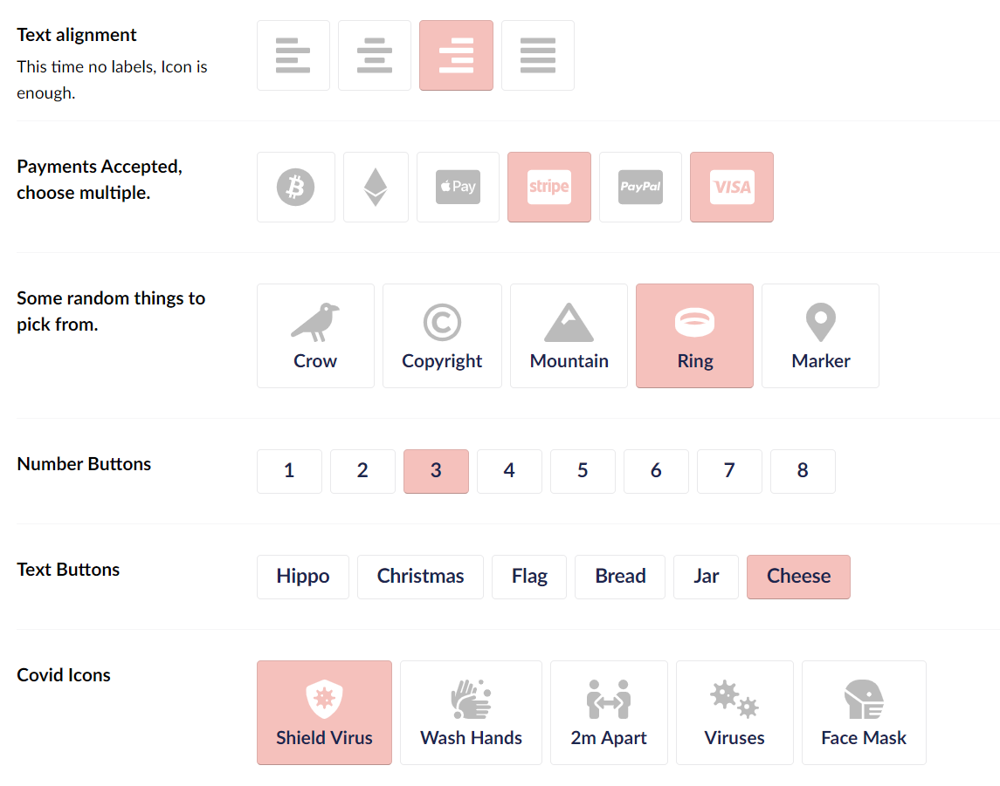

# PROJECT IS ARCHIVED
Check out:
[SvgIconPropertyEditor](https://github.com/creativesuspects/SvgIconPropertyEditor) for an alternative.

# Umbraco 8 Font Awesome Icons | Links | Buttons
Umbraco V8 Font Awesome Links Property Editor, render icons, links and buttons in the Umbraco backoffice.

### Documentation & Guide:

[Font Awesome Icons | Links | Buttons Documentation](http://jacker.io/tutorials-articles/umbraco-font-awesome-extension-documentation-installation-and-usage-examples/)

### Important:

If the icons don't appear, then increment your clientdependency version in config/ClientDependency.config to regenerate the cache.

### Property Editors:

- Font Awesome Icon  
- Font Awesome Links 
- Font Awesome Buttons

### Versions:

- Umbraco 8.9+
- Font Awesome 8.15.1 (includes Covid Icons)
